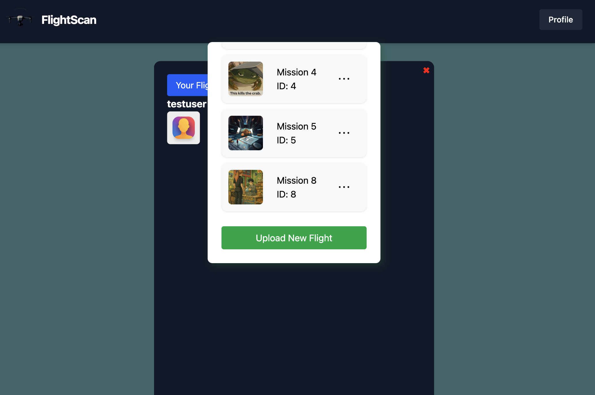
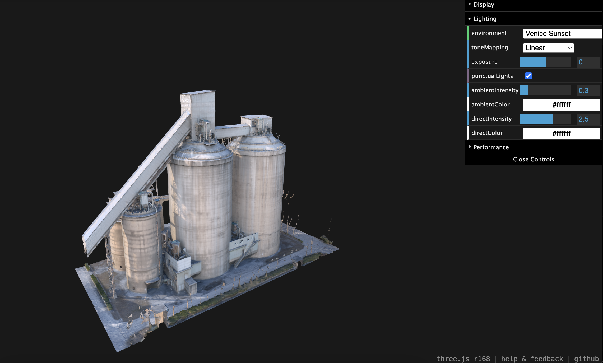

<i>WIP</i> 
<h3>FlightScan is a webapp for drone enthusiasts</h3>
<ul>
<li>Plan automatic drone flights with the mission builder.</li>
<li>Build projects with your drone footage.</li>
<li>Share your flights and projects with others on the platform.</li>
</ul>

This app is centered on orthomosiacs, photogrammetry, multispectrum scans and other projects that can be made with your drone footage.

<h3>Live site is coming soon!</h3>
 

 
<i>Drone Flight Planner <a href="https://github.com/RydCri/DroneMission_flights">In development</a></i>
 

 
<i>Webapp component</i>
 

 
<i>Photogrammetry Constructor</i>
 